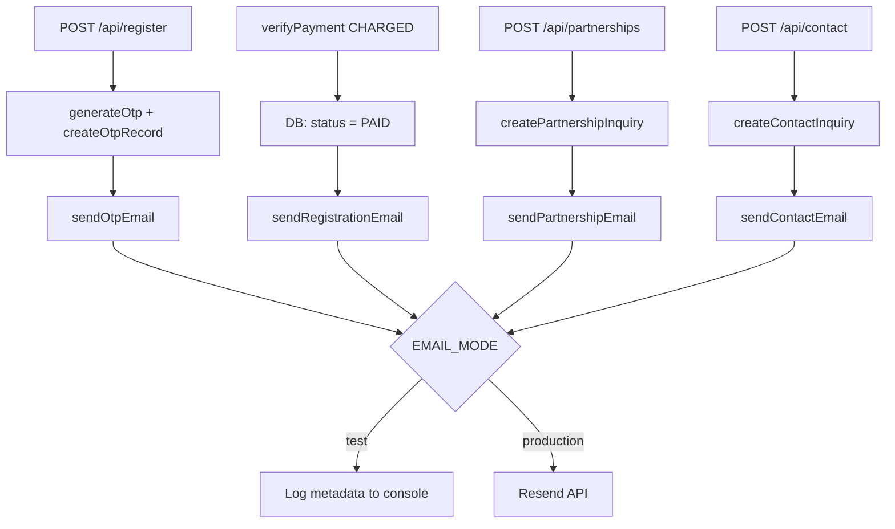

# Phase 7 — Email Automation (Resend Integration)

## 1. Files Created

**Email Core**
- `lib/email/client.ts` - Resend singleton instantiation.
- `lib/email/send-email.ts` - The core sender service that branches on `EMAIL_MODE`.
- `lib/email/log-email-event.ts` - Structured logger for all email dispatches.

**Email Templates** (HTML generators, no business logic)
- `lib/email/templates/otp-template.ts`
- `lib/email/templates/registration-template.ts`
- `lib/email/templates/partnership-template.ts`
- `lib/email/templates/contact-template.ts`

**Email Delivery Services** (Typed, template-aware dispatchers)
- `lib/email/send-otp-email.ts`
- `lib/email/send-registration-email.ts`
- `lib/email/send-partnership-email.ts`
- `lib/email/send-contact-email.ts`

**Partnership & Contact Infrastructures**
- `lib/validations/partnership-inquiry.ts`
- `lib/validations/contact-inquiry.ts`
- `lib/inquiries/create-partnership-inquiry.ts`
- `lib/inquiries/create-contact-inquiry.ts`
- `app/api/partnerships/route.ts`
- `app/api/contact/route.ts`

## 2. Files Modified
- `app/api/register/route.ts` - Added `sendOtpEmail` call after `createOtpRecord`. Never rolls back on failure.
- `lib/payment/verify-payment.ts` - Added `sendRegistrationEmail` after HDFC `CHARGED` triggers `RegistrationStatus.PAID`. Fetches venue from Sanity via `CONFERENCE_BY_ID_QUERY`.
- `lib/sanity/queries.ts` - Added `CONFERENCE_BY_ID_QUERY` to support fetching the venue during registration confirmation.
- `app/partnerships/page.tsx` - Switched to a client component and wired the existing form structure to POST to `/api/partnerships`. Added loading/success UI states.
- `app/components/CTASection.tsx` - Added a fully functional React `contact` form directly next to the original "mailto" buttons, retaining the initial design but wired to `/api/contact`.
- `.env` - Appended testing environment configurations.

## 3. Architecture Summary
The newly added layer decouples email transport logic from the rest of the application. 

1. **Routing Layer**: APIs strictly call the core service functions (`createPartnershipInquiry`, `generateOtp`, etc.) without knowing about emails.
2. **Business/Database Layer**: Perform the required persistence/logic (`db.registration.update`, `db.partnershipInquiry.create`). Once the core operation is fully confirmed (e.g. `status: PAID` updated in Prisma), the email service is called inside a `try/catch`. 
3. **Email Layer**: The `send-[type]-email.ts` invokes a specific template mapping to `sendEmail()`.
4. **Transport Layer**: `sendEmail()` branches between outputting to standard out + structured logs (`EMAIL_MODE=test`) or actually making the REST call to Resend (`EMAIL_MODE=production`).
5. **Resiliency**: If `sendEmail` throws an error or fails, the catch block intercepts it, logs the event using `logEmailEvent`, and returns. No `throw` leaks back to the business transaction, ensuring OTPs or Payments never roll back just because an email failed to send.

## 4. Email Flow Diagram



## 5. Build Output
```
> smg-mun@0.1.0 build
> prisma generate && next build

Loaded Prisma config from prisma.config.ts.
Prisma schema loaded from prisma\schema.prisma.
✔ Generated Prisma Client (v7.8.0) to .\node_modules\@prisma\client in 239ms
...
✓ Compiled successfully in 39.2s
  Finished TypeScript in 17.0s ...
✓ Generating static pages using 7 workers (19/19) in 2.2s

Exit code: 0
```

## 6. Test Mode Demonstration
When running with `EMAIL_MODE=test` inside `.env`, any triggered email bypasses the HTTP call to Resend and logs the following structure to the server console:

```
[EMAIL TEST MODE]
Type: OTP
To: user@example.com
Subject: SMJ MUN Verification Code

[EMAIL EVENT] [2026-06-13T14:38:00.000Z] Type: OTP | To: user@example.com | Subject: SMJ MUN Verification Code | Status: SUCCESS
```
*(No exact OTPs or secrets are dumped into logs).*

## 7. Production Switch Instructions

**Currently in `.env`:**
```env
RESEND_API_KEY=re_placeholder
EMAIL_FROM=onboarding@resend.dev
EMAIL_REPLY_TO=test@example.com
EMAIL_MODE=test
```

**To enable Production without touching code:**
1. Securely generate a production API Key in your Resend Dashboard.
2. Verify a sending domain in Resend (e.g. `smjmun.com`).
3. Update `.env` / Vercel Environment Variables:
```env
RESEND_API_KEY=re_LIVE_API_KEY
EMAIL_FROM=noreply@smjmun.com
EMAIL_REPLY_TO=contact@smjmun.com
EMAIL_MODE=production
```
4. Redeploy or restart your NextJS server.

## 8. Manual Testing Checklist

- [ ] Submitting the **Registration Form** creates a new OTP and prints the Test OTP Email event to your terminal.
- [ ] Completing a **HDFC Payment Simulation** prints the Test Registration Confirmation event to your terminal showing "TBA" for missing venues or actual venues matched from Sanity.
- [ ] Submitting the **Partnerships Form** (`/partnerships`) renders the Success UI state and prints a Test Partnership Email event to the terminal.
- [ ] Submitting the **Contact Form** (in the footer/CTA sections) renders the Success UI state and prints a Test Contact Email event to the terminal.
